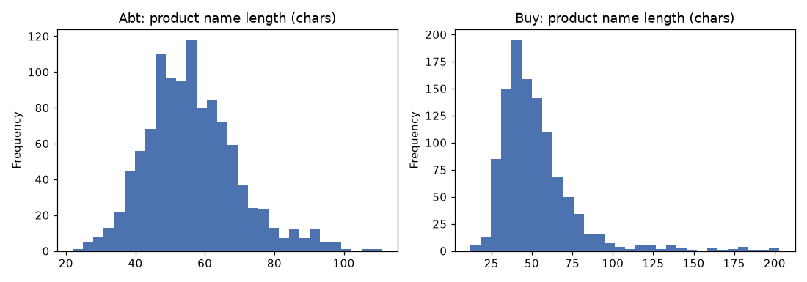

# Data quality and exploration (Abt-Buy)

## Catalog profiles (python checks)

### Abt
| metric | value |
|---|---|
| rows | 1081 |
| missing_price_pct | 61.3 |
| missing_description_pct | 0.0 |
| missing_manufacturer_pct | 0.0 |
| empty_name_rows | 0 |
| duplicate_name_rows | 0 |
| median_price | 99.97 |

### Buy
| metric | value |
|---|---|
| rows | 1092 |
| missing_price_pct | 46.0 |
| missing_description_pct | 40.4 |
| missing_manufacturer_pct | 0.0 |
| empty_name_rows | 0 |
| duplicate_name_rows | 19 |
| median_price | 169.065 |

## Gold mapping quality
| metric | value |
|---|---|
| pairs | 1097 |
| duplicate_pairs | 0 |
| dangling_abt_ids | 0 |
| dangling_buy_ids | 0 |
| abt_ids_with_many_buy | 16 |
| buy_ids_with_many_abt | 5 |
| abt_coverage_pct | 100.0 |
| buy_coverage_pct | 100.0 |

## 01_completeness

Completeness per catalog: one aggregate pass per table, no row-level output.

| catalog | rows | missing_price_pct | missing_description_pct | missing_manufacturer_pct | median_price |
|---|---|---|---|---|---|
| abt | 1081 | 61.3 | 0.0 | 0.0 | 99.97 |
| buy | 1092 | 46.0 | 40.4 | 0.0 | 169.07 |

## 02_brand_overlap

Top brands on each side and how many products of that brand the other catalog has.
Brand vocabularies differ ("sony" vs "sony corp"), which is why brand match is a soft feature.

| brand | n_abt | n_buy |
|---|---|---|
| sony | 178 | 171 |
| panasonic | 101 | 101 |
| canon | 89 | 86 |
| samsung | 55 | 57 |
| apple | 28 | 28 |
| garmin | 27 | 27 |
| nikon | 24 | 24 |
| sanus | 24 | 24 |
| toshiba | 24 | 24 |
| logitech | 20 | 22 |
| linksys | 20 | 20 |
| denon | 19 | 19 |
| weber | 18 | 17 |
| pioneer | 18 | 15 |
| sirius | 13 | 15 |

## 03_mapping_cardinality

Cardinality of the gold mapping: how many Abt products link to more than one Buy product
and vice versa. A perfect 1:1 mapping would give zero in both rows.

| direction | ids |
|---|---|
| abt -> many buy | 16 |
| buy -> many abt | 5 |
| abt products without any match | 0 |
| buy products without any match | 0 |

## 04_price_gap_on_true_matches

Relative price gap on gold pairs where both sides have a price.
Filter first (both prices present), then aggregate: the join touches ~1k rows, not 1M.

| priced_pairs | p50_gap | p90_gap | p99_gap | pairs_gap_over_50pct |
|---|---|---|---|---|
| 226 | 0.176 | 0.415 | 0.667 | 9.0 |

## 05_shared_model_code

Share of gold pairs whose names share at least one model code (token with letters AND digits).
This is the single strongest signal, so it is worth knowing its coverage before modeling.

| gold_pairs | pairs_sharing_code | pct | pairs_with_side_lacking_code |
|---|---|---|---|
| 1097 | 476.0 | 43.4 | 266.0 |

