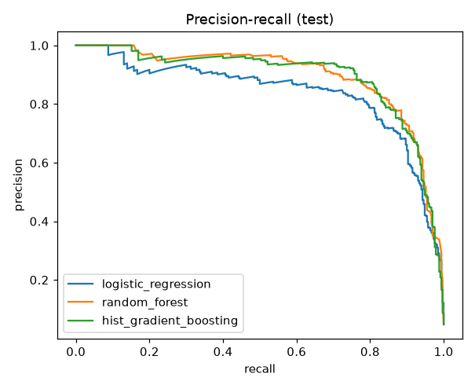
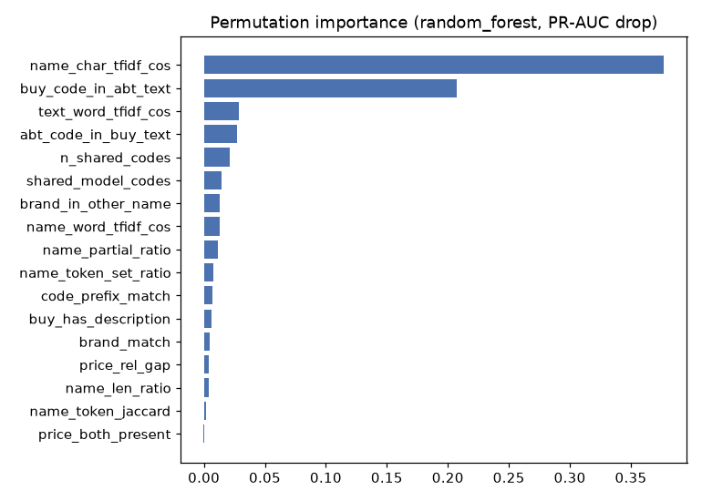

# Model results

Pipeline run time: 49s on CPU. Split: 70/30 by Abt product id, 16185 train / 6908 test pairs.

## Blocking
| metric | value |
|---|---|
| gold_pairs | 1097 |
| gold_pairs_in_candidates | 1089 |
| recall_pct | 99.3 |
| candidates | 23093 |
| all_pairs | 1180452 |
| reduction_ratio_pct | 98.04 |
| positive_rate_pct | 4.72 |

## Models (test set, threshold tuned on train out-of-fold predictions)
| model | cv_pr_auc | precision | recall | f1 | roc_auc | pr_auc | threshold |
|---|---|---|---|---|---|---|---|
| logistic_regression | 0.8687 | 0.7473 | 0.8242 | 0.7839 | 0.988 | 0.8374 | 0.921 |
| random_forest | 0.8988 | 0.8516 | 0.8 | 0.825 | 0.9905 | 0.8949 | 0.423 |
| hist_gradient_boosting | 0.9026 | 0.8411 | 0.8182 | 0.8295 | 0.99 | 0.8917 | 0.491 |

Best hyperparameters:

```json
{
  "logistic_regression": {
    "clf__C": 0.1
  },
  "random_forest": {
    "max_depth": null,
    "min_samples_leaf": 1
  },
  "hist_gradient_boosting": {
    "learning_rate": 0.05,
    "max_iter": 200,
    "max_leaf_nodes": 31
  }
}
```



## Feature importance (random_forest)
| feature | importance |
|---|---|
| name_char_tfidf_cos | 0.3771 |
| buy_code_in_abt_text | 0.2075 |
| text_word_tfidf_cos | 0.029 |
| abt_code_in_buy_text | 0.0271 |
| n_shared_codes | 0.0214 |
| shared_model_codes | 0.0147 |
| brand_in_other_name | 0.0131 |
| name_word_tfidf_cos | 0.0131 |
| name_partial_ratio | 0.0115 |
| name_token_set_ratio | 0.0078 |



## Error analysis (random_forest, threshold 0.42)

Confusion matrix (rows = true 0/1, cols = predicted 0/1):

```
[[6532   46]
 [  66  264]]
```

Uncertain pairs (0.3 < p < 0.7): 134 of 6908 test pairs, 69 of them true matches.

### False negatives (true matches the model rejected)

- p=0.00 `iHome Black Clock Radio Audio System For iPod - IH9BR` (nan) vs `IH9B6R BLACK ALARM CLOCK F/IPODPERPCHARGES DOCKED IPOD REMOTE CONTROL` (nan)
- p=0.01 `Garmin Nuvi 360 010-10723-06 Black 12 Volt Adapter Cable - 0101072306` (47.0) vs `Garmin Cigarette Lighter Adapter for GPS` (nan)
- p=0.02 `LG Pearl Gray XL Capacity Electric Dryer - DLE5955G` (nan) vs `LG 7.3 cu.ft. Front Control, ST Drum,Chrome Door Trim (Pearl Gray)` (nan)
- p=0.02 `Sanus 13' - 30' VisionMount Flat Panel TV Silver Wall Mount - VMFS` (39.99) vs `Sanus Flat Panel TV Wall Mount - VMF` (nan)
- p=0.02 `Panasonic Genius Countertop Microwave In White - NNH965WH` (nan) vs `Panasonic NN-H965WF Luxury Full-Size 2-1/5-Cubic-Foot 1250-Watt Microwave Oven- White` (nan)
- p=0.02 `Monster Mini-To-Mini iCable For Car - AICMINIIP3S` (15.0) vs `Monster Cable iCable A IC MINI IP-3 S Audio Stereo Cable - 123870` (nan)
- p=0.02 `Belkin Cush Top For Computer Laptop - F8N044ORG` (nan) vs `Belkin Orange Cushtop` (nan)
- p=0.02 `LG 24' LDS4821BB Semi Integrated Built In Black Dishwasher - LDS4821BK` (nan) vs `LG Semi-Integrated Electronic Panel with Digital Status Display` (nan)

### False positives (non-matches the model accepted)

- p=0.98 `Belkin F3H982-25 Black 25 Ft Pro Series High Integrity VGA/SVGA Monitor Replacement Cable - F3H98225` (nan) vs `Belkin Pro Series High Integrity VGA/SVGA Monitor Extension Cable - F3H982-10` (nan)
- p=0.98 `Sony DVP-FX820 Black 8' Portable DVD Player - DVPFX820` (nan) vs `Sony DVP-FX820/R Portable DVD Player - DVPFX820/R` (159.94)
- p=0.97 `Sony DVP-FX820 Black 8' Portable DVD Player - DVPFX820` (nan) vs `Sony DVP-FX820/L Portable DVD Player - DVPFX820/L` (131.54)
- p=0.97 `Sony DVP-FX820 Black 8' Portable DVD Player - DVPFX820` (nan) vs `Sony DVP-FX820/P Portable DVD Player - DVPFX820/P` (148.72)
- p=0.90 `Delonghi Twenty Four Seven Coffee Maker - DC50W` (22.0) vs `DeLonghi DC50B Twenty Four Seven Drip Coffee Maker, Black` (22.95)
- p=0.86 `Sony DVP-FX820 Black 8' Portable DVD Player - DVPFX820` (nan) vs `Sony DVPFX820 Portable DVD Player - DVPFX820/W` (149.0)
- p=0.82 `Canon Black EF 70-300mm F/4-5.6 IS USM Telephoto Zoom Lens - 0345B002` (nan) vs `Canon EF 75-300mm f/4-5.6 III Telephoto Zoom Lens - 6473A003` (159.95)
- p=0.79 `Sony Pink Cyber-Shot 7.2 Megapixel Digital Camera - DSCW120P` (nan) vs `Sony Cyber-shot DSC-W120 Digital Camera - Silver - DSCW120` (106.42)

### Mapping quality monitoring: gold pairs with the lowest model confidence

These are the existing mappings a data steward should re-check first.

- p=0.00 `iHome Black Clock Radio Audio System For iPod - IH9BR` (nan) vs `IH9B6R BLACK ALARM CLOCK F/IPODPERPCHARGES DOCKED IPOD REMOTE CONTROL` (nan)
- p=0.01 `Garmin Nuvi 360 010-10723-06 Black 12 Volt Adapter Cable - 0101072306` (47.0) vs `Garmin Cigarette Lighter Adapter for GPS` (nan)
- p=0.02 `LG Pearl Gray XL Capacity Electric Dryer - DLE5955G` (nan) vs `LG 7.3 cu.ft. Front Control, ST Drum,Chrome Door Trim (Pearl Gray)` (nan)
- p=0.02 `Sanus 13' - 30' VisionMount Flat Panel TV Silver Wall Mount - VMFS` (39.99) vs `Sanus Flat Panel TV Wall Mount - VMF` (nan)
- p=0.02 `Panasonic Genius Countertop Microwave In White - NNH965WH` (nan) vs `Panasonic NN-H965WF Luxury Full-Size 2-1/5-Cubic-Foot 1250-Watt Microwave Oven- White` (nan)
- p=0.02 `Monster Mini-To-Mini iCable For Car - AICMINIIP3S` (15.0) vs `Monster Cable iCable A IC MINI IP-3 S Audio Stereo Cable - 123870` (nan)
- p=0.02 `Belkin Cush Top For Computer Laptop - F8N044ORG` (nan) vs `Belkin Orange Cushtop` (nan)
- p=0.02 `LG 24' LDS4821BB Semi Integrated Built In Black Dishwasher - LDS4821BK` (nan) vs `LG Semi-Integrated Electronic Panel with Digital Status Display` (nan)
